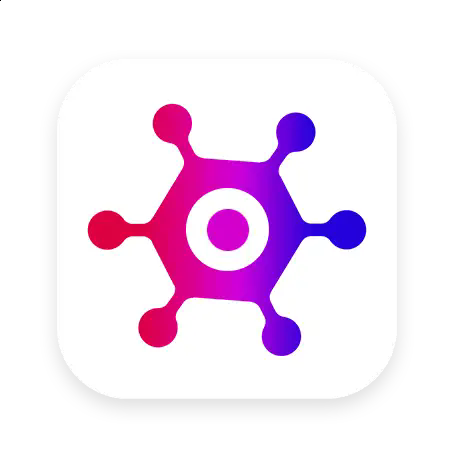
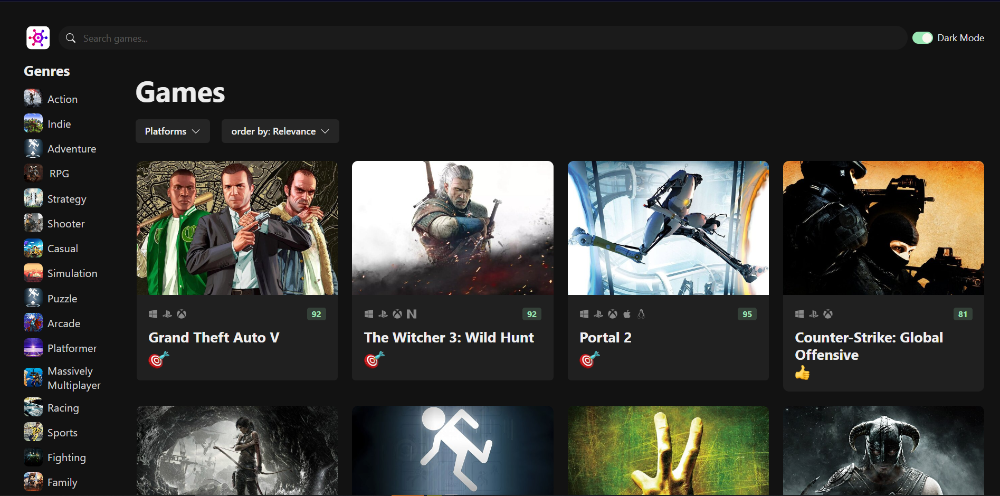

<br/>
<p align="center">
  <a href="https://github.com/Kiana8181/gameHub-part2">
    
  </a>

  <h3 align="center">Game Hub</h3>

  <p align="center">
    Video Game Discovery App
    <br/>
    <br/>
    <a href="https://game-hub-six-neon.vercel.app/">View Demo</a>
    .
  </p>
</p>


## Table Of Contents

* [About the Project](#about-the-project)
  * [Features](#features)
* [Getting Started](#getting-started)
  * [Prerequisites](#prerequisites)
  * [Installation](#installation)
* [Usage](#usage)
* [Roadmap](#roadmap)
* [Contributing](#contributing)
* [License](#license)
* [Authors](#authors)
* [Acknowledgements](#acknowledgements)

<br />

## About The Project



Welcome to the Video Game Discovery App! This app allows you to discover and explore video games using the [RAWG](https://rawg.io/) API as its backend. You can view a list of games, see their platform, ratings, and apply various filters such as name, platform, genre, and more. Additionally, you can access detailed information about each game by clicking on its name.

<br />

### Features

- Confidently build front-end apps with React and TypeScript.
- Implement form validation using Zod.
- Fetch and update data using React Query for improved performance and caching.
- Implement infinite scrolling for seamless browsing.
- Use reducers to consolidate state management logic.
- Manage application state using Zustand.
- Implement routing with React Router for smooth navigation.
- Deploy the app on Vercel for easy access.

  <br />
  <br />

## Getting Started

Follow these steps to clone and set up the Makima project on your local machine:

### Prerequisites

Make sure you have the following prerequisites installed on your system:

- node v19.5.0
- npm (Python package manager)
```

### Installation

1. Clone the Repository

You can clone the repository using either HTTPS or SSH:

**HTTPS:**
```sh
https://github.com/Kiana8181/gameHub-part2.git
```

**SSH:**
```sh
git@github.com:Kiana8181/gameHub-part2.git
```

<br/>
<br/>

2. Navigate to the project directory:

```sh
cd gameHub-part2
```

<br/>
<br/>

3. Install dependencies:

```sh
npm install
```

<br/>
<br/>

4. Start the development server:

```sh
npm run dev
```

Open your web browser and access the project at `http://localhost:5173`.

That's it! You now have the Makima Frontend running locally on your machine.

<br/>
<br/>

5. Builds the app for production(optional):

```sh
npm run build

```

<br/>
<br/>

6. Start the production server(optional):

```sh
npm run preview
```

Open your web browser and access the project at `http://localhost:4173`.
